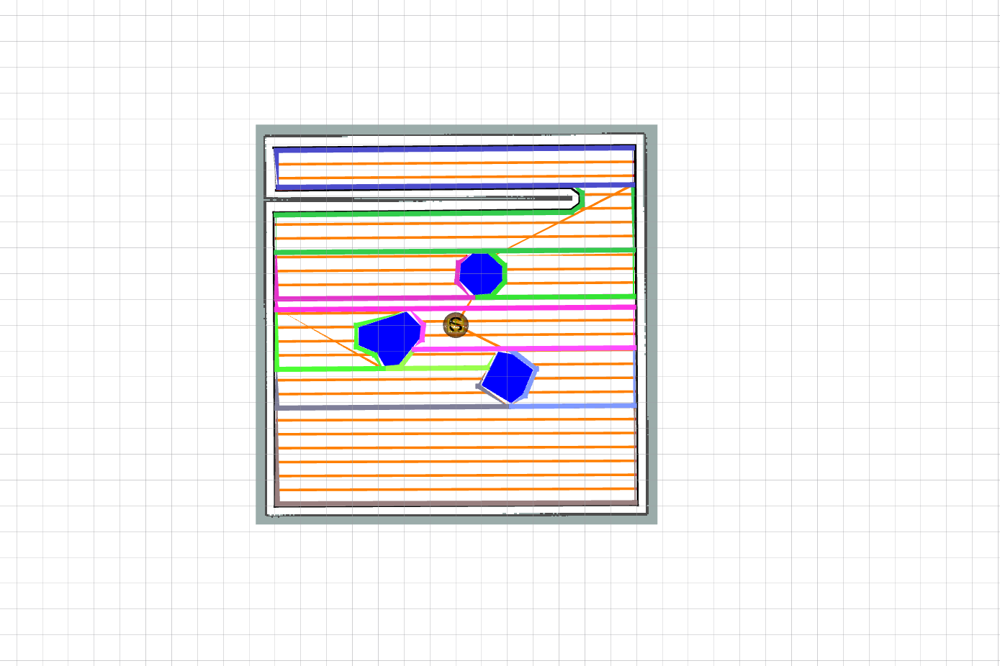

### Extract polygons from map file

- Modify the polygon coverage project from https://github.com/ethz-asl/polygon_coverage_planning
- Install dependencies

```bash
# Package dependencies.
echo "Installing CGAL dependencies."
sudo apt-get install -y libcgal-dev
echo "Installing MONO dependencies."
sudo apt-get install -y mono-devel
echo "Installig GLOG dependencices."
sudo apt-get install -y libgoogle-glog-dev
```

